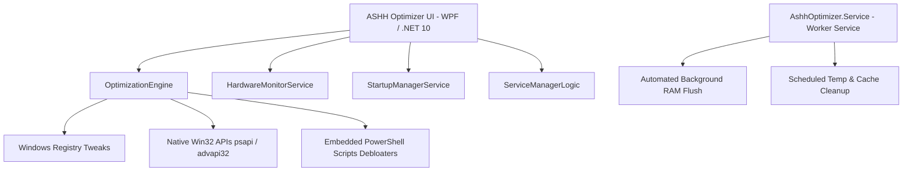

<div align="center">

# ⚡ ASHH Optimizer

### *The Ultimate High-Performance Windows 10 & 11 System Tuning Suite*

[](https://dotnet.microsoft.com/)
[](https://www.microsoft.com/windows)
[](https://github.com/ShravanDDeotale/AshhOptimizer)
[](LICENSE)

<br/>

<p align="center">
  
</p>

<p align="center">
  <b>ASHH Optimizer</b> is an all-in-one, ultra-fast Windows optimization tool designed to reduce latency, strip telemetry bloat, free memory, monitor hardware health in real time, and maximize gaming & workflow performance.
</p>

---

</div>

## 📌 Table of Contents

- [✨ Key Features](#-key-features)
- [🏗️ System Architecture](#️-system-architecture)
- [🚀 Quick Start & Installation](#-quick-start--installation)
- [🛠️ Build from Source](#️-build-from-source)
- [📦 Packaging & Deployment](#-packaging--deployment)
- [⚙️ Configuration & Automated Service](#️-configuration--automated-service)
- [🤝 Contributing](#-contributing)
- [📄 License](#-license)

---

## ✨ Key Features

### ⚡ 1. System Performance & Power Tuning
- **Ultimate Performance Plan:** Automatically unhides and enables the Windows Ultimate Performance power scheme.
- **CPU Core Unparking:** Reduces CPU throttling and eliminates micro-stutters during heavy workloads.
- **Latency Optimization:** Disables network throttling index and configures TCP/IP registry parameters for lower in-game ping.

### 🛡️ 2. Privacy & Windows Debloating
- **Telemetry Stripper:** Disables telemetry services, Diagnostic Tracking (DiagTrack), Cortana, and Feedback Hub.
- **Windows 10 & 11 Debloater:** Integrates PowerShell-based clean debloat routines to remove pre-installed bloatware apps safely.
- **Background App Restrictions:** Stops unwanted background processes from consuming CPU cycles.

### 🧹 3. Deep Cache & Disk Purging
- **Temporary Files Purge:** Cleans User Temp, System Temp (`C:\Windows\Temp`), and Prefetch caches.
- **Windows Update & Delivery Optimization:** Clears leftover patch caches and delivery optimization data.
- **Standby Memory Purging:** Cleans working sets and stand-by RAM lists using native Windows API calls (`EmptyWorkingSet`, `NtSetSystemInformation`).

### 📊 4. Real-time Hardware Monitoring
- Real-time CPU, GPU, and RAM utilization tracker.
- Temperature and clock frequency monitoring powered by **LibreHardwareMonitor**.
- Clean aesthetic gauges and responsive sensor graphs.

### 🔧 5. Services & Startup Management
- **Startup Manager:** Inspect and toggle startup applications to accelerate Windows boot times.
- **Service Optimizer:** Safely manages resource-heavy background services (SysMain, Diagnostic Policy, Connected User Experiences, Xbox services).

### 🎨 6. Modern Dark Neon UI (BMW M Edition)
- Fluid WPF interface with custom dark aesthetic, glowing neon accents, and smooth scroll behavior.
- Interactive spotlight effects and acrylic backdrops for a sleek modern look.

---

## 🏗️ System Architecture



### 📁 Directory Layout

```
AshhOptimizer/
├── AshhOptimizer.Service/      # Background Windows Worker Service
│   ├── Program.cs             # Service host configuration
│   ├── Worker.cs              # Timed optimization logic & RAM flusher
│   └── AshhOptimizer.Service.csproj
├── OptimizerUI/               # Main WPF User Interface
│   ├── MainWindow.xaml        # Modern UI layout & styles
│   ├── MainWindow.xaml.cs     # Event handling & UI interactions
│   ├── OptimizationEngine.cs  # Core tuning & registry tweak engine
│   ├── HardwareMonitorService.cs # CPU / GPU / RAM sensors
│   ├── StartupManagerService.cs # Boot item manager
│   ├── ServiceManagerLogic.cs   # Windows service manager
│   └── OptimizerUI.csproj
├── assets/                    # Application logos & graphic resources
├── build_exe.bat              # 1-Click Automated build & packaging script
├── Install.bat                # Automated system installer & service registrar
├── optimizer.slnx             # Visual Studio Solution file
├── setup.iss / setup_v2.iss   # Inno Setup installer scripts
└── README.md                  # Project documentation
```

---

## 🚀 Quick Start & Installation

### Option 1: Automated 1-Click Installer
1. Right-click [`Install.bat`](Install.bat) and select **Run as administrator**.
2. The script will deploy the UI to `C:\Program Files\ASHH Optimizer`, create desktop & start menu shortcuts, and register the background service.

### Option 2: Portable Run
1. Run `build_exe.bat` to generate the portable package.
2. Navigate to `Output/AshhOptimizer-Portable/` and launch `ASHH Optimizer.exe`.

---

## 🛠️ Build from Source

### Prerequisites
- **Operating System:** Windows 10 (1809+) or Windows 11 (64-bit)
- **SDK:** [.NET 10.0 SDK](https://dotnet.microsoft.com/download/dotnet/10.0)
- **Compiler (Optional for Installer):** [Inno Setup 6](https://jrsoftware.org/isinfo.php)

### 1. Clone the Repository
```bash
git clone https://github.com/ShravanDDeotale/AshhOptimizer.git
cd AshhOptimizer
```

### 2. Build via .NET CLI
```bash
# Build the complete solution
dotnet build optimizer.slnx -c Release

# Publish Standalone Single-File Executables
dotnet publish OptimizerUI/OptimizerUI.csproj -c Release -r win-x64 --self-contained true -p:PublishSingleFile=true -o Output/Publish/OptimizerUI
dotnet publish AshhOptimizer.Service/AshhOptimizer.Service.csproj -c Release -r win-x64 --self-contained true -p:PublishSingleFile=true -o Output/Publish/Service
```

### 3. Build via Automated Script
Simply run:
```cmd
build_exe.bat
```

---

## ⚙️ Configuration & Automated Service

The background service `AshhOptimizer.Service` runs silently in the background and can periodically flush memory and purge caches:

- **Registry Key:** `HKEY_LOCAL_MACHINE\SOFTWARE\AshhOptimizer`
- **Value:** `AutoTimer` (DWORD)
  - `0`: Disabled
  - `N`: Interval in minutes (e.g., `15`, `30`, `60`)

When enabled, the service automatically executes `EmptyWorkingSet` across running processes and removes temporary files safely.

---

## 📄 License

This project is licensed under the [MIT License](LICENSE) - see the LICENSE file for details.

---

<div align="center">
  <b>Developed with ❤️ for maximum Windows performance</b>
</div>
